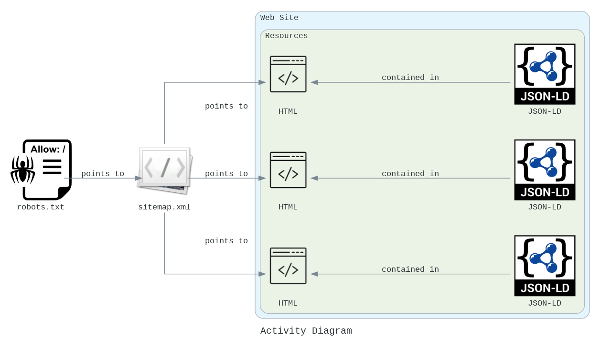
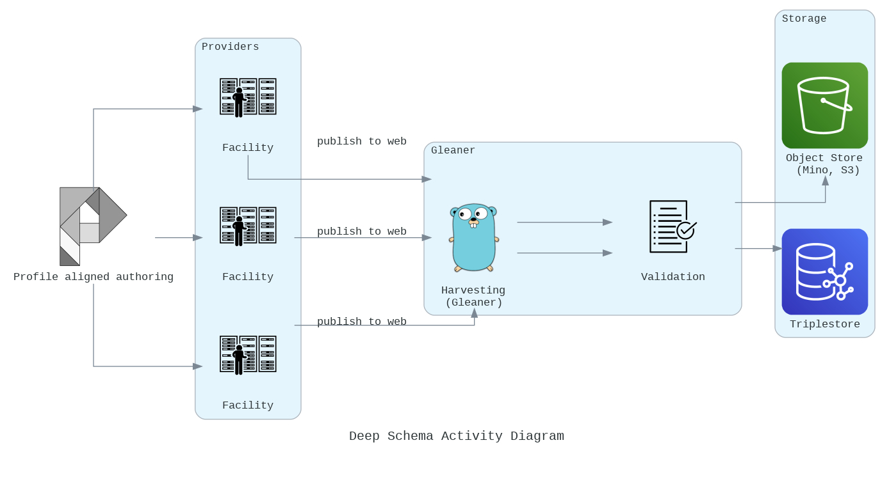

# Glenaer.io Stack

## About

A simple repository to describe the layout of a reference
search architecture and some associated configuration approaches.

## Base actions

## Activity Diagram of Operation

## Architecture

This is a simple reference architecture for a search service.  
It scopes the collection of the data from providers via
gleaner and pipes those resources through a system that
implements an approaches influenced by RDA Digital Object Cloud
and GoFAIR Fair Implementation Frameworks (FIF).  

In the end a basic search UI is provided but it is only for
reference for a more detailed and feature rich UI that matches
community needs.

Every element below is optional and can be replaced with
packages that provide similar functionality.   It would be easy, for
example, to implement many elements in a cloud native approach on
AWS, Google Cloud or Azure.  

## Configuration

Another section is exploring using [Cue](https://cuelang.org) to 
allow easy generation of the various configuration files for the 
Acme certs, S3 access, bucket paths, etc.   At present, there is
not much there. 
